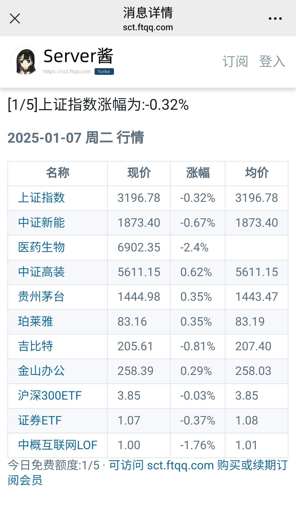
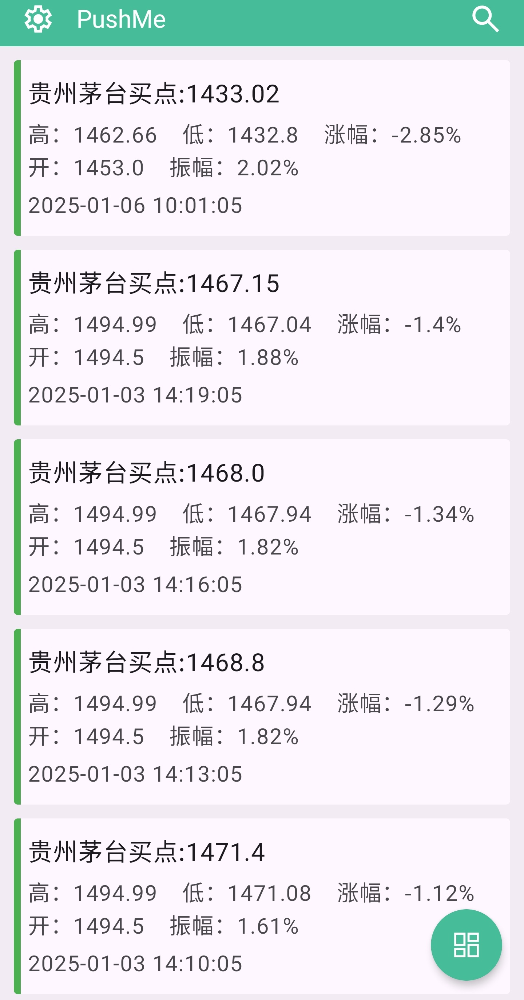
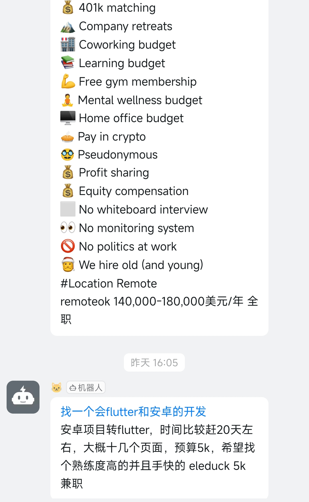
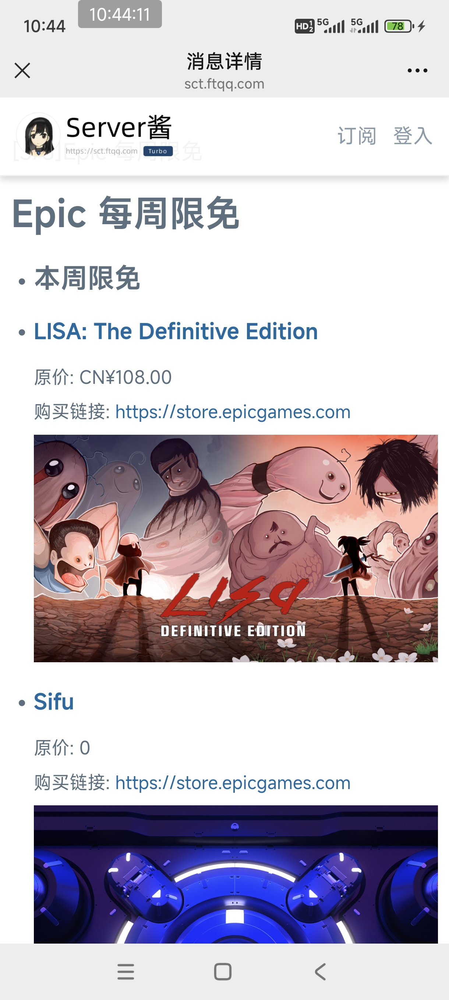
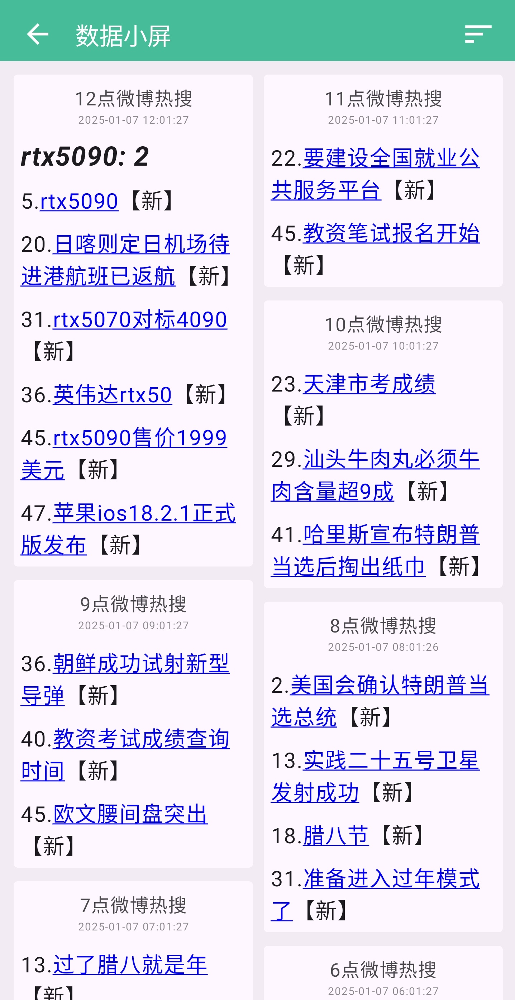

# QinglongMy

自用青龙脚本库，抓取特定数据处理。将结果格式化为 Markdown 文本后通过机器人发送通知

| [Server酱(微信服务号) ](https://sct.ftqq.com/sendkey/r/14730) | [PushMe(App)](https://push.i-i.me/) |             钉钉机器人              |
|:-------------------------------------------------------:|:-----------------------------------:|:------------------------------:|
|                           |       |  |
|                           |       |                                |

## 功能

* [epic_free_game](epic_free_game.py) Epic每周限免信息
* [stock_spider](stock_spider.py) 获取股票、指数行情数据推送到微信，支持实时查看行情
* [trade_notify](trade_notify.py) 监控指定股票的行情，并在满足特定条件时发送通知，提醒买入或卖出时机
* [weibo_summary](weibo_summary.py) 通过 newsnow 线上接口（https://newsnow.busiyi.world/api/s?id=weibo ）获取微博热搜榜；Sqlite 数据库去重，过滤不感兴趣内容，简单词频分析
* [send_qq_email](send_qq_email.py) 发送带附件的电子邮件
* [job_spider](job_spider.py) 指定过滤条件获取远程工作信息
* [xb](xb.py) 全网羊毛线报精选，使用 gemini-3-flash-preview 模型进行内容分析
* [douban_spider](douban_spider.py) 豆瓣小组（上海租房版demo）
* [workbuddy_checkin](workbuddy_checkin.py) WorkBuddy 每日积分自动签到（100积分/天，连续第7天1000积分），**默认只读环境变量**，`--export-env`（或 `--export-env --save` 写回 .env）可读取本机登录态刷新 token，幂等可重复运行
* [trae_checkin](trae_checkin.py) Trae Work 每日积分自动签到，**默认只读环境变量**（不再自动读本机）；**内置自动续期/自愈**：access token 仅约 14 天有效，脚本用 `refreshToken` + 设备 ECDSA 私钥（`--export-keys` 引导，纯标准库签名、无需第三方库）向 `ExchangeToken` 换发新 token，在「无 token / 即将过期(<48h) / 鉴权失败」时自动续期并重试，续期结果写回 `.trae_token.json` 缓存（青龙环境靠它自愈）；`--export-keys`（同 `--export-env`）/ `--renew` 配合 `--save` 可写回 .env 刷新
* [minimax_checkin](minimax_checkin.py) MiniMax Code 每日积分自动签到（400积分/天，第4、7天1000积分），**默认只读环境变量**（不再自动读本机），逆向 `yy`/`x-signature` 签名；**每次运行先调 `/v1/api/user/renewal` 续期（相当于先登录）再签到**，新 token 自动写回 `.minimax_token.json` 缓存（青龙环境靠它自愈，token 永不失效）；`--export-env`（先续期再导出）/`--renew`（仅续期）配合 `--save` 可写回 .env 刷新
* [meituan_checkin](meituan_checkin.py) 美团每日领券，POST 发券接口、Token 走请求体（无需 Cookie），**默认只读环境变量**（MT_TOKEN / MT_AISCENE / MT_CLIENT_ID），本地每日缓存去重，`--export-env` 可从本机 pt-passport 缓存导出 token 写回 .env
* [checkin_all](checkin_all.py) 聚合签到（推荐）：**只需设一个定时**，依次跑 WorkBuddy / Trae Work / MiniMax Code 签到，合并结果后**只发一次推送**。各子脚本的单独定时可停用/删除。另支持 `python checkin_all.py --export-env --save` **一条命令批量刷新 token**（等价逐个执行各子脚本的 `--export-env --save`），要求本机对应桌面端/已登录态均已就绪

## 安装依赖库

   ```shell
   pip3 install -r requirements.txt
   ```

## 添加仓库

   ```shell
   ql repo https://github.com/mgmg22/QinglongMy.git "summary|stock_spider|trade|epic_free_game|xb|send_qq|job|checkin" "activity|backUp" "sendNotify|stopwords|util|vless" "main"
   ```

## 推送渠道及在线测试

[Server酱](https://sct.ftqq.com/sendkey/r/14730)(每天5条免费推送额度)

[PushMe](https://push.i-i.me/)

[Gemini API密钥](https://aistudio.google.com/app/apikey)

钉钉群机器人

## 配置文件

```shell
## ql repo命令拉取脚本时需要拉取的文件后缀，直接写文件后缀名即可
RepoFileExtensions="js py txt"

# server酱的 PUSH_KEY
export PUSH_KEY_MY=
export PUSH_KEY_SECOND=

## PushMe key
export PUSH_ME_KEY=
## 邮箱地址和smtp密钥
export EMAIL_ADDRESS=
export EMAIL_PWD=

## 钉钉机器人key
export XB_BOT_TOKEN=
export JOB_BOT_TOKEN=

## Gemini API密钥和API域名
export API_KEY=
export API_URL=

## WorkBuddy 每日签到（workbuddy_checkin.py）
# 脚本【默认只读取以下环境变量】，不自动读取本机登录态
# token 过期时，在本机（已登录 WorkBuddy 桌面端 v5.3.8+）执行：python workbuddy_checkin.py --export-env --save 即可刷新
export WB_ACCESS_TOKEN=
export WB_USER_ID=

## Trae Work 每日签到（trae_checkin.py）
# 脚本【默认只读取以下环境变量】，不自动解密本机登录态
# 【自动续期/自愈】token 约 14 天有效；用 refreshToken + 设备 ECDSA 私钥自动续期（无需桌面端在服务器上运行）
# 引导：本机已登录 Trae 桌面端执行 python trae_checkin.py --export-keys --save 写回下列全部变量（含设备私钥）
#   - 设备 id 取 storage.json 中 iCubeAuthInfo://icube-dc:<numeric> 键的数字部分；服务端按注册指纹校验 device id，
#     UUID 格式的 telemetry.devDeviceId 不被识别为注册设备，会触发更严格限流（sign 接口 code 9074）
#   - 切勿把设备 id 填成 UUID；--export-keys 导出的已是正确数字值
export TRAE_TOKEN=
export TRAE_DEVICE_ID=
export TRAE_USER_ID=
export TRAE_REFRESH_TOKEN=
export TRAE_DEVICE_KEY_PEM=
export TRAE_DEVICE_PUB_PEM=
export TRAE_MACHINE_ID=

## MiniMax Code 每日签到（minimax_checkin.py）
# 脚本【默认只读取以下环境变量】，不自动读取本机登录态
# 【先续期再签到】每次运行先调 /v1/api/user/renewal 换新 token（有效期顺延 ~40 天），
#   新 token 自动写回脚本同目录缓存 .minimax_token.json（青龙改不动环境变量，靠缓存自愈）
# 填 token 时千万别带引号（青龙面板最常见坑，会直接 401）；脚本会自动去除首尾空白与配对引号
#
# 服务器用 `export` 直接传参即可（如 WB_ACCESS_TOKEN=…），无需 dotenv；load_dotenv()
#   默认不覆盖已存在的环境变量，故即使未装 python-dotenv 也能读到 export 的变量（WB 即如此跑通）。
#   务必保证 MINIMAX_USER_ID = storage.json 里的 realUserID（不是 JWT 的 user.id），否则 status/claim 直 401
#   （renewal 不校验 user_id，故表现为「续期成功但签到 401」）。
#
# 服务器出口被透明 TLS 网关【全阻断】时，可经 VLESS 订阅由内置零依赖代理出网：
#   MINIMAX_SUB 指定订阅地址，脚本自动抓取并由内置零依赖代理（vless_proxy.py，纯标准库，
#   不依赖任何外部客户端、不下载二进制）在签到前拉起本地代理，结束后自动关闭
#   （节点自动滚动，单点失效不影响）。订阅地址示例（整条用【单引号】包裹）：
#       export MINIMAX_SUB='https://rom.msdmcp.top/sub?token=54fb6f9b95583ec8ad17bad7493a276f'
# token 失效/过期时：先去 MiniMax Agent 客户端重新登录（让其写回新 token），再在本机执行：
#   python minimax_checkin.py --export-env --save  即可把最新 token/设备参数写回 .env
# 只想续期现有 token（token 尚有效即可，任意机器）：
#   python minimax_checkin.py --renew --save
export MINIMAX_TOKEN=
export MINIMAX_USER_ID=
# 可选：设备身份参数，留空时回落到脚本内写死的稳定默认值
export MINIMAX_UUID=
export MINIMAX_DEVICE_ID=
# 可选：出网代理（出口被网关阻断时用到；默认直连）。由 MINIMAX_SUB 指定 VLESS 订阅地址
export MINIMAX_SUB=

## 美团每日领券（meituan_checkin.py）
# 脚本【默认只读取以下环境变量】；美团的 token 由 Node 端 run.js 扫码登录获得（无自动续期）
# 获得后填入 MT_TOKEN 即可；未设置时脚本会回退读本机 pt-passport 缓存
export MT_TOKEN=
export MT_AISCENE=        # 可选：场景标识，留空时回退读插件 config.json
export MT_CLIENT_ID=      # 可选：客户端 id，留空用内置稳定默认值
   ```

若没有使用load_dotenv()，所有新增PUSH_KEY需要在[sendNotify](sendNotify.py)的push_config中配置key名称后才能生效

## 本地开发

复制 .env.example 为 .env 并填写配置


## Special statement:

* Any unlocking and decryption analysis scripts involved in the Script project released by this warehouse are only used
  for testing, learning and research, and are forbidden to be used for commercial purposes. Their legality, accuracy,
  completeness and effectiveness cannot be guaranteed. Please make your own judgment based on the situation. .

* All resource files in this project are forbidden to be reproduced or published in any form by any official account or
  self-media.

* This warehouse is not responsible for any script problems, including but not limited to any loss or damage caused by
  any script errors.

* Any user who indirectly uses the script, including but not limited to establishing a VPS or disseminating it when
  certain actions violate national/regional laws or related regulations, this warehouse is not responsible for any
  privacy leakage or other consequences caused by this.

* Do not use any content of the Script project for commercial or illegal purposes, otherwise you will be responsible for
  the consequences.

* If any unit or individual believes that the script of the project may be suspected of infringing on their rights, they
  should promptly notify and provide proof of identity and ownership. We will delete the relevant script after receiving
  the certification document.

* Anyone who views this item in any way or directly or indirectly uses any script of the Script item should read this
  statement carefully. This warehouse reserves the right to change or supplement this disclaimer at any time. Once you
  have used and copied any relevant scripts or rules of the Script project, you are deemed to have accepted this
  disclaimer.

**You must completely delete the above content from your computer or mobile phone within 24 hours after downloading.
**  </br>
>
***You have used or copied any script made by yourself in this warehouse, it is deemed to have accepted this statement,
please read it carefully*** 