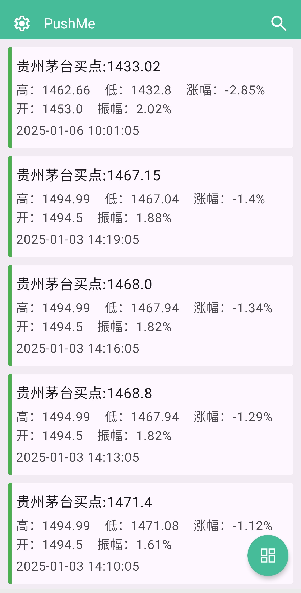

# QinglongMy

自用青龙脚本库，抓取特定数据处理。将结果格式化为 Markdown 文本后通过机器人发送通知

<a href="screenshots/preview-1.jpg">

</a>
<a href="screenshots/preview-2.jpg">

</a>
<a href="screenshots/preview-3.jpg">

</a>

## 功能
* [epic_free_game](epic_free_game.py) Epic每周限免信息
* [stock_spider](stock_spider.py) 获取股票、指数行情数据推送到微信，支持实时查看行情
* [trade_notify](trade_notify.py) 监控指定股票的行情，并在满足特定条件时发送通知，提醒买入或卖出时机
* [weibo_summary](weibo_summary.py) 抓取微博热搜榜，Sqlite数据库去重，过滤一些不感兴趣的内容，简单的词频分析
* [send_qq_email](send_qq_email.py) 发送带附件的电子邮件
* [job_spider](job_spider.py) 指定过滤条件获取远程工作信息
* [xb](xb.py) 全网羊毛线报精选

## 安装依赖库
   ```shell
   pip3 install -r requirements.txt
   ```
## 添加仓库

   ```shell
   ql repo https://github.com/mgmg22/QinglongMy.git "summary|stock_spider|trade|epic_free_game|xb|send_qq|job" "activity|backUp|bewly" "sendNotify|stopwords|util" "main"
   ```

## 推送渠道及在线测试
[Server酱](https://sct.ftqq.com/sendkey/r/14730)(每天5条免费推送额度)

[PushMe](https://push.i-i.me/) 

[wxpusher](https://wxpusher.zjiecode.com/admin/main/message/send) 


钉钉群机器人
## 配置文件

```shell
## ql repo命令拉取脚本时需要拉取的文件后缀，直接写文件后缀名即可
RepoFileExtensions="js py txt"

# server酱的 PUSH_KEY
export PUSH_KEY_MY="";
export PUSH_KEY_SECOND="";

## PushMe的push_key
export PUSH_ME_KEY="";

## qq邮箱地址和smtp密钥
export EMAIL_ADDRESS="";
export EMAIL_PWD="";

## gemini key和url
export API_KEY="";
export API_URL="";

## WxPusher
export WX_PUSH_TOKEN="";
   ```
若没有使用load_dotenv()，所有新增PUSH_KEY需要在[sendNotify](sendNotify.py)的push_config中配置key名称后才能生效

## 本地开发
  复制 .env.example 为 .env 并填写配置

## 全网羊毛线报精选-微信订阅


## Special statement:

* Any unlocking and decryption analysis scripts involved in the Script project released by this warehouse are only used
  for testing, learning and research, and are forbidden to be used for commercial purposes. Their legality, accuracy,
  completeness and effectiveness cannot be guaranteed. Please make your own judgment based on the situation. .

* All resource files in this project are forbidden to be reproduced or published in any form by any official account or
  self-media.

* This warehouse is not responsible for any script problems, including but not limited to any loss or damage caused by
  any script errors.

* Any user who indirectly uses the script, including but not limited to establishing a VPS or disseminating it when
  certain actions violate national/regional laws or related regulations, this warehouse is not responsible for any
  privacy leakage or other consequences caused by this.

* Do not use any content of the Script project for commercial or illegal purposes, otherwise you will be responsible for
  the consequences.

* If any unit or individual believes that the script of the project may be suspected of infringing on their rights, they
  should promptly notify and provide proof of identity and ownership. We will delete the relevant script after receiving
  the certification document.

* Anyone who views this item in any way or directly or indirectly uses any script of the Script item should read this
  statement carefully. This warehouse reserves the right to change or supplement this disclaimer at any time. Once you
  have used and copied any relevant scripts or rules of the Script project, you are deemed to have accepted this
  disclaimer.

**You must completely delete the above content from your computer or mobile phone within 24 hours after downloading.
**  </br>
>
***You have used or copied any script made by yourself in this warehouse, it is deemed to have accepted this statement,
please read it carefully*** 